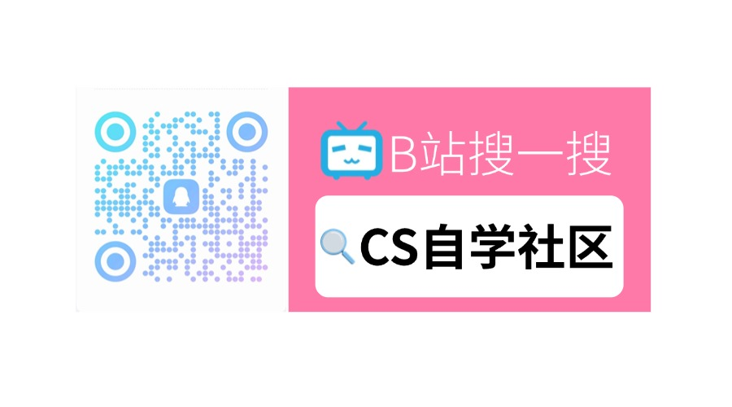
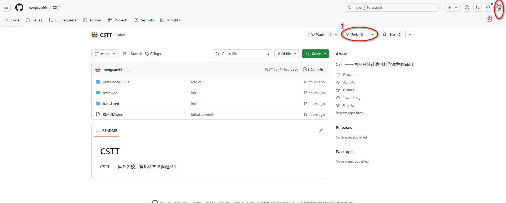
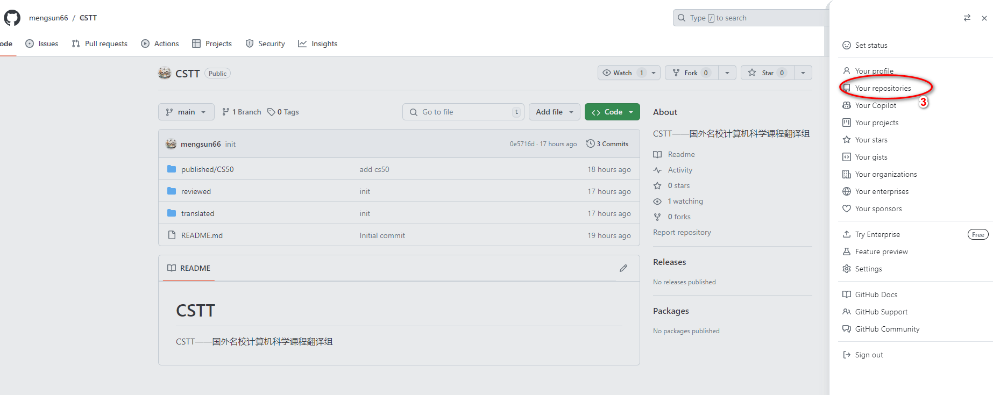
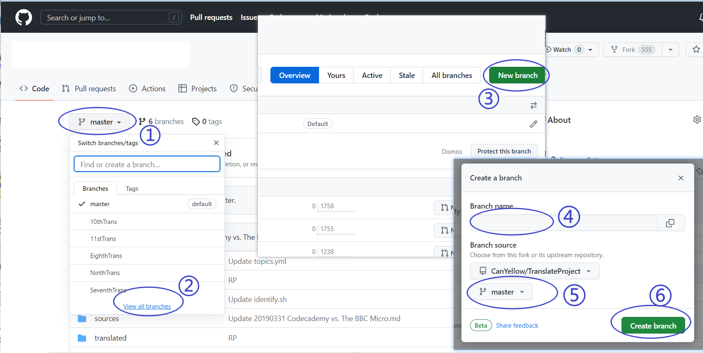
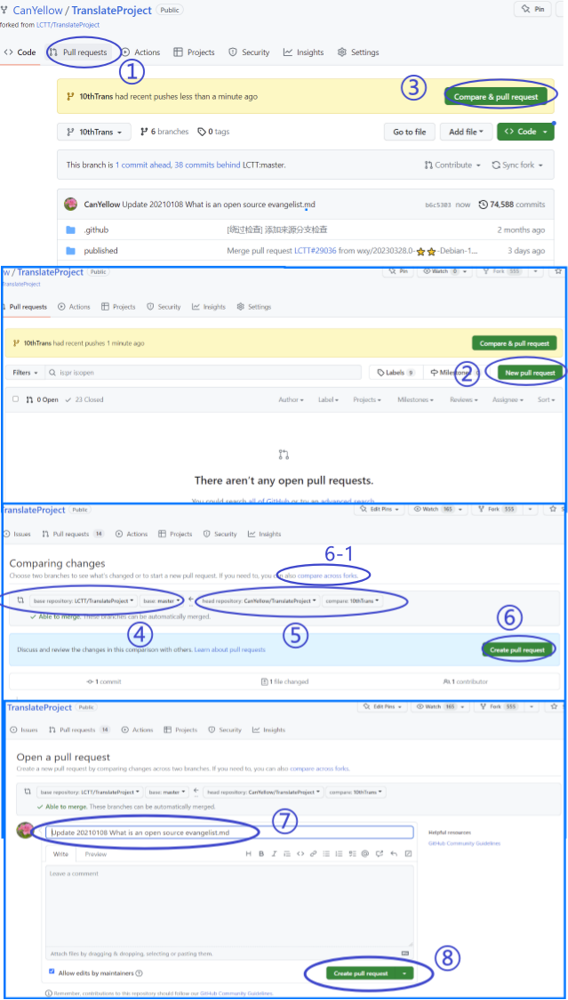

# GCTT Go 中文网翻译组

## 简介

CSTT 国外名校 CS 课程中文翻译组 是由 CS 自学社区（https://www.learncs.site) 仿照“Linux中国”发起的课程翻译组，负责将国外大学优秀的CS课程字幕翻译为中文，并发布到 CS 自学社区。

## CSTT 流程

```mermaid
graph TD;
    A[发起课程翻译
    通过issue提交课程翻译] --> B[社区投票];
    B --> C{是否投票通过};
    C -->|是| D[关闭issue];
    D --> H[社区使用AI初译];
    H --> I[推送初译字幕到
    translated 目录];
    I --> J[创建课程精校任务表]
    
    J --> L[领取精校任务];
    L --> M[精校AI翻译字幕];
    M --> N[提交精校字幕到
    review 目录];
    N --> O{是否
    所有精校任务完成};
    O --> | 否 | L;
    O --> | 是 | K[从review 目录转移
精校字幕到publish 目录];
    K --> P[社区压制字幕
    并发布中英视频];
    P --> Q[提交翻译纠错PR];
    Q --> P ;
    C -->|否| E[关闭issue];
    E --> F[等待一个月];
    
    F --> A;

```

## 加入我们

想加入CS社区的视频翻译共创共建，请先加入CS自学社区的的 QQ 群，群号是：556890917，加群时请说明是“志愿者”。加入后记得修改您的群名片为您的 GitHub 的 ID。

关注b站：CS自学社区

## 如何开始
### 准备工作
在您初次进行 CSTT 的精校工作之前，您需要完成一些基础的准备工作。这些工作至少包括 GitHub 账号注册、复刻 CSTT 主仓库到您的名下（复刻到您账户下的仓库副本后文将直接简称“仓库副本”）。
#### 1. GitHub 账号注册
CSTT是基于git多人协作的项目。因此在准备精校之前，您需要访问 GitHub 注册一个 GitHub 账号。
#### 2. 复刻 CSTT 主仓库到您的名下
在您完成注册后，您可以使用您的账号登录 GitHub 并访问 CSTT 项目的主仓库地址。在该页面的右上角您将发现一个后面带有数字的 Fork 按钮（下图中 ① 处），您需要点击该按钮以将本仓库 复刻fork 到您的账户下。在执行完上述操作后，您可以依次点击下图中 ②、③ 处，进入您的 GitHub 主页确认在您账户中是否已经存在仓库副本 

成功后，你就有一个自己的 CSTT 仓库了，在这个仓库你可以进行任何操作。在遇到棘手的问题时，你甚至可以删除掉你的这个本地仓库，重新复刻（如果你有任何需要保留的修改，请另行备份）。

## 如何提交想要翻译的课程
提交课程翻译请使用 issue 提交，请按照 issue 模板填写。填写课程简介是越详细越好，若有课程官网之外的课程相关资源，请提供。提交前请先查看一下是否已有人提交过该课程，如果有人提交过该课程，请勿重复提交。

## 如何认领精校任务
### 1.确保你的仓库副本是最新的。
若在你的仓库副本中，看到如下图所示的提示，请点击 Sync fork 按钮，及时更新你的仓库副本。

### 2.创建新分支
在仓库副本中，创建一个新的分支，分支名称为：`精校-课程名称-{你的github ID}`，例如：`精校-cs61a-yangyang`。
您可以在仓库副本的主页上按下图的顺序操作。依次点击 ①、②，然后在转到的页面中点击 ③ 处来在弹出的窗口中创建分支。在弹出的分支中，您需要在 ④ 处输入您想创建的分支名称，并在 ⑤ 处将父分支切换为 master 分支，然后点击 ⑥ 创建即可。

需要注意的是，我们推荐您在创建分支时，**一律将新创建的分支的父分支设为 master**，即在 ⑤ 处切换为 master 分支。因为 master 分支没有多余的提交记录，能够保证在后面提交翻译时，推送到主仓库的修改没有多余的提交历史。

### 3.在精校任务表标记你要认领的课程

在仓库副本中，打开 `review/{课程名称}/精校任务表.md` 文件，在表格中，找到你要认领的课程，将状态列中的状态修改为 `认领中`，并填写你的 GitHub ID。

由于修改比较简单，你可以直接在网页上操作。

### 4.将精校任务认领修改推送到主仓库
此过程有点复杂，懒得自己做图了，直接从LCTT借鉴（copy）！

在仓库副本的主页中点击下图 ① 处进入推送页面，在推送页面中，点击 ② 处创建新的推送，此时页面刷新变为 ④、⑤、⑥ 所处的状态。您也可以在主页中点击 ③ 直接进入 ④、⑤、⑥ 所处的状态中。在该状态的页面中，后部的 ⑤ 处为需要推送的内容，前部的 ④为推送到的目标。我们是需要将仓库副本中当前翻译分支的变更推送到 CSTT 的主仓库的 master 分支中，因此 ⑤ 处应当填入仓库副本的当前翻译分支，④ 处应当填入主仓库的 master 分支。您可以点击 ④、⑤ 处的对应复选框，然后在下拉菜单中选择正确的内容。在您切换 ④、⑤ 处的内容的时候，可能会出现不显示仓库名称只显示分支名称的情况，此时，您可以点击 ⑥-1 处将仓库名称显示出来。您正确的完成 ④、⑤ 处的选择后，点击 ⑥ 处提交推送申请，在刷新的页面中的 ⑦ 处输入本次推送的说明，点击 ⑧ 处确认提交推送申请，这意味着您成功提交了一个将仓库副本中当前翻译分支的变更合并到 CSTT 的主仓库的 master 分支的推送申请。

最后在接下来转到的页面中，如果等待检查结束后，⑨ 处显示通过检查，说明您的推送没有问题，等待主仓库的管理员同意合并您的翻译申请后，该推送就可以合并进主仓库的 master 分支了。您就可以开始翻译了。

不过通常来说，只要您在推送时显示并无冲突、也稍后通过了 ⑨ 处的 CI 检查，基本意味着您的翻译申请不存在与他人的翻译申请重复的情况，您就可以自行翻译了，而不需要等待 PR 得到批准。每翻译一篇文章，都需要单独就此文章发起一个上面的修改头部译者 ID 的 PR 以提出您的翻译申请。

我们强烈建议：请为每篇翻译的文章创建一个单独的分支，在此分支进行申请、翻译和提交译文。在最终译文进入了 CSTT TranslateProject 主仓库后，就可以安全地删除该分支。

## 字幕精校
精校字幕前你需要安装一个字幕编辑器，我们推荐使用 Aegisub。
由于精校内容通常较长，一般难以一次完成，我们推荐您的精校工作在本地完成。这通常需要通过 Git 客户端或者 git 命令行实现。
### 1. 转移文章到reviewed 文件夹
在你的仓库副本的当前翻译分支中的translate 文件夹中找到您已经申领精校的字幕，将其复制一份到 review/{课程名称} 文件夹中。然后对复制出来的文件进行修改。

### 2.提交精校字幕
按照任务认领中的相同的步骤将主仓库的 master 分支的变更同步到您的仓库副本的您当前正在翻译的分支中。然后按照相同的步骤将您的项目副本的当前翻译的分支推送到主仓库的 master 分支中。